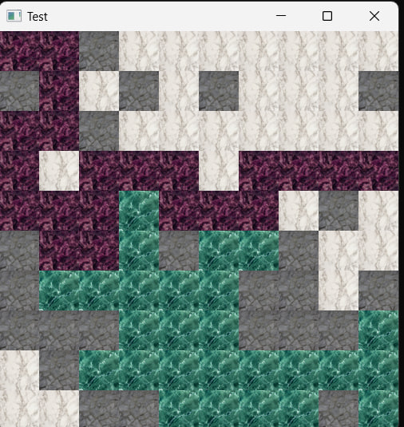
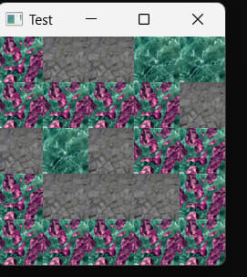

# BFS-DFS
This is my implmention of two algorithms: BFS and DFS.

Firstly, at the beginning of the code there is `#define N value` by changing value, you are changing number of rows and colums (they are equal). 

Secondly, the board generates by itself.

Thirdly, BFS and DFS start their action, by default starting point of DFS is `(0,0)` and BFS is `(N-1, N-1)`.

## Examples of execution 

